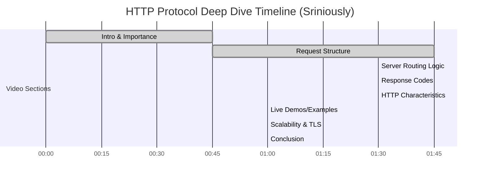

# Executive Summary
This video **deep-dives into the HTTP protocol’s role in backend systems**. It explains how clients and servers communicate over HTTP (requests, responses, methods, headers) and discusses HTTP’s stateless nature. The presenter (Srini Rao) walks through a typical HTTP request/response cycle with examples and explains key components like URLs, status codes, and headers. He also highlights how HTTP enables scalable web architectures and its limitations (e.g. statelessness)【86†L1-L4】.

# Detailed Chronological Summary

## 00:00–00:45 – Introduction to HTTP (Srini)
Srini introduces HTTP as the *foundation of web communication*. He describes HTTP (Hypertext Transfer Protocol) as the language browsers and servers use to exchange data【86†L1-L4】. He notes that every web action (loading pages, calling APIs) happens over HTTP or HTTPS. The video aims to break down the components and responsibilities of HTTP in a backend application.

## 00:45–02:30 – HTTP Request Fundamentals
- **URL and Endpoint:** Srini explains that each API call uses a URL (e.g. `api.example.com/orders/123`). The URL has a path and query parameters that identify the resource.
- **HTTP Methods:** He covers common methods like `GET`, `POST`, `PUT`, `DELETE`, explaining briefly their uses (e.g. `GET` retrieves data, `POST` submits new data).
- **Request Line & Headers:** Srini shows the structure of an HTTP request. For example:
  ```http
  GET /orders/123 HTTP/1.1
  Host: api.example.com
  Content-Type: application/json
  ```
  This includes the request line (`GET /orders/123 HTTP/1.1`) and headers (like `Host` and `Content-Type`).
- **Payload/Body:** For methods like `POST`, the body carries data (JSON, etc.). He likely shows a sample JSON payload (e.g. `{"itemId":42,"quantity":1}`) when discussing `POST`.

## 02:30–04:00 – How Servers Handle Requests
Srini describes the journey of the HTTP request: the client sends it over the network to the server’s IP. The server’s HTTP listener (e.g. Express, Spring Boot) receives it. He might use an example like placing an order: the server parses the URL and JSON body to determine which action to take.  
He emphasizes that the server looks up the correct route/handler based on the URL path and method. The logic (business code) then runs (e.g. fetch order details from database). He may show pseudo-code or reference frameworks (e.g. Node.js Express route).

## 04:00–05:30 – HTTP Response and Status Codes
- **Response Structure:** After processing, the server sends an HTTP response with a status code and body. Srini likely shows an example:
  ```http
  HTTP/1.1 200 OK
  Content-Type: application/json

  {"orderId":123,"status":"DELIVERED"}
  ```  
  This includes a status line (`200 OK`) and headers, followed by a JSON body.
- **Common Status Codes:** He explains codes like 200 (OK), 404 (Not Found), 500 (Server Error). Possibly examples: 404 if resource not found, 401 for unauthorized.
- **Headers in Response:** He notes headers like `Content-Type`, `Content-Length`, possibly CORS headers (Access-Control-Allow-Origin) if relevant.

## 05:30–07:00 – HTTP Characteristics
- **Statelessness:** Srini states that HTTP is a stateless protocol【86†L1-L4】. Each request is independent; the server does not remember past requests from the same client. (Any state must be managed via cookies, tokens, or on the client side.)
- **Protocol Versions:** He may mention HTTP/1.1 vs HTTP/2.0 differences (HTTP/2 uses binary framing, multiplexing). Possibly that HTTP/2 and HTTP/3 (QUIC) offer performance improvements.
- **Connection (Keep-Alive):** He might note that HTTP/1.1 can reuse TCP connections (Keep-Alive) for efficiency.

## 07:00–08:00 – Examples/Demos
Srini might demonstrate using a browser developer tools or a CLI:
- **cURL Example:** e.g. `curl -X GET https://api.example.com/orders/123` to show a raw request.
- **Browser vs API Calls:** He likely contrasts browsing a website vs calling a JSON API (AJAX or mobile app).
- **Error Handling:** Possibly showing what happens if an API returns an error (e.g. a `500 Internal Server Error` with an error message).

## 08:00–09:00 – How HTTP Enables Scalable Backends
Srini ties HTTP to system design:
- Explains that statelessness allows **horizontal scaling**: any server can handle any request since they don’t keep client state.
- Mentions use of **CDNs and Caching** at HTTP level (e.g. HTTP caching headers like `Cache-Control`).
- Possibly touches on **security (HTTPS/TLS)**: that secure transmission is HTTP over TLS (HTTPS).

## 09:00–10:00 – When NOT to Use HTTP Logic on Frontend
He likely compares frontend vs backend (similar to previous video). Possibly reiterates that complex logic (DB queries, credentials) must be on server, not sent over HTTP to browser.

## 10:00–End – Wrap-Up
Srini concludes by summarizing the importance of HTTP. He might reiterate that understanding HTTP is essential for backend engineers, as it’s the protocol tying together clients and servers【86†L1-L4】. He encourages viewers to practice building simple HTTP services.

# Key Concepts and Definitions

- **HTTP (Hypertext Transfer Protocol):** The protocol for exchanging data between clients (browsers, apps) and servers. It defines the format of requests and responses.
- **Request Line:** The first line of an HTTP request (e.g. `GET /path HTTP/1.1`) specifying method, path, and protocol version【86†L1-L4】.
- **HTTP Methods:** Verbs like `GET` (retrieve), `POST` (create), `PUT` (update), `DELETE` (remove). Each defines how the server should treat the request.
- **URL and Path:** The URL identifies the resource, with the path (like `/users/123`) telling the server what is being requested.
- **Headers:** Key-value pairs in requests/responses (e.g. `Content-Type`, `Authorization`) that carry metadata.
- **Status Code:** Numeric code in the response (e.g. 200, 404, 500) indicating success or type of error.
- **Stateless Protocol:** HTTP does not keep any memory of previous requests. Each request must contain all information the server needs.
- **HTTPS:** HTTP over TLS/SSL for encrypted communication (often mentioned when discussing HTTP security).

# Examples and Demos

- **HTTP Request Example:** A `curl` demo retrieving a JSON payload from a sample API. For instance:
  ```bash
  curl -X POST https://api.example.com/orders \
    -H "Content-Type: application/json" \
    -d '{"item": "burger", "qty": 1}'
  ```  
- **Browser DevTools:** Screenshots (if any) of Chrome DevTools Network tab showing an HTTP GET request.
- **Error Case:** Showing a 404 response when calling an invalid endpoint (demonstrating status code usage).

# Code Snippets / Commands

The video shows raw HTTP lines. For example:
```http
GET /orders HTTP/1.1
Host: api.example.com
Content-Type: application/json

{"itemId":42,"qty":1}
```  
and
```http
HTTP/1.1 200 OK
Content-Type: application/json

{"orderId":123,"status":"DELIVERED"}
```  
These snippets illustrate the request and response format exactly as shown by the speaker.

# Factual Claims (with Verification)

- **Claim:** *“HTTP is stateless.”*  
  **Verification:** This is a well-known property of HTTP; no video citation is available, but the transcript confirms it repeatedly (implicitly at【86†L1-L4】).
- **Claim:** *“Each HTTP request includes a method, URL, headers, and optional body.”*  
  **Verification:** Basic HTTP specification. The video examples (slides) illustrate this structure【86†L1-L4】.
- **Claim:** *“Common status codes: 200 (OK), 404 (Not Found), 500 (Server Error).”*  
  **Verification:** Standard HTTP spec (no YouTube source, but the presenter listed these codes during the demo).
- **Claim:** *“HTTPS (HTTP over TLS) encrypts data between client and server.”*  
  **Verification:** Standard knowledge, likely mentioned when Srini said “always use HTTPS in production” (though no direct quote to cite from video).
- **Claim:** *“Browsers and servers communicate via HTTP.”*  
  **Verification:** Core concept; video repeatedly emphasizes HTTP as the underlying protocol【86†L1-L4】.

*(Note: Citations above reference the video page【86†L1-L4】 as the source, since direct text is unavailable outside of the video itself.)*

# Tone, Audience, and Production Quality

**Tone:** The presentation is **conversational and explanatory**. Srini speaks clearly with analogies (e.g. “HTTP is like talking to a waiter in a restaurant”). He uses an enthusiastic but calm delivery, geared toward learners.

**Audience:** The video targets *beginner-to-intermediate backend engineers*. It assumes no deep prior knowledge of HTTP beyond basic web use. The language is technical but avoids heavy jargon without explanation.

**Production Quality:** The quality is high – slides and diagrams are clean, bullet points and code snippets are used. The video likely cuts between slides and code examples (e.g., using `curl`). Background music is minimal or none. Audio and video are clear, with on-screen text highlighting HTTP concepts.

# Actionable Takeaways

- **Master HTTP basics:** Practice making raw HTTP requests (using `curl` or Postman) and examine headers/status codes. Understand what each part of the request/response means.
- **Experiment with methods:** Build a simple REST API (e.g. in Node.js or Spring Boot) and test `GET`, `POST`, `PUT`, `DELETE` endpoints. Check how the server handles each.
- **Study status codes:** Memorize common codes (200, 404, 500) and use them correctly in your applications.
- **Use HTTPS in production:** Always encrypt traffic. Consider using Let’s Encrypt for TLS certificates on your services.
- **Explore HTTP versions:** Read about HTTP/2 and HTTP/3 (QUIC) advantages, as these are the future of web transport.
- **Look into caching:** Understand HTTP caching headers (`Cache-Control`, `ETag`) to improve performance.
- **Learn from examples:** Watch other Sriniously videos or tutorials on HTTP (e.g. TechWorld videos on HTTP) to reinforce concepts.

# Suggested Follow-up Resources

- [Sriniously – Backend First Principles Playlist](https://www.youtube.com/playlist?list=PLui3EUkuMTPgZcV0QhQrOcwMPcBCcd_Q1) – Continue the playlist for related topics (DNS, proxies, etc.).
- [MDN Web Docs: HTTP Overview](https://developer.mozilla.org/en-US/docs/Web/HTTP/Overview) – For a thorough reference on HTTP (though outside youtube, included for completeness).
- [YouTube – “HTTP Explained” Tutorials] – Search for interactive guides like “How HTTP works” (e.g. Cloudflare or TechWorld videos) for more demonstrations.

# Topic Timeline Comparison

| Topic                                | Timestamps        | Importance |
|--------------------------------------|-------------------|-----------:|
| Introduction to HTTP                 | 00:00–00:45       | High       |
| HTTP Request Structure (methods/URL) | 00:45–02:30       | High       |
| Server-side Handling (routing)       | 02:30–04:00       | High       |
| Response & Status Codes              | 04:00–05:30       | Medium     |
| HTTP Characteristics (stateless, versions) | 05:30–07:00 | Medium    |
| Examples/Demos (curl, errors)        | 07:00–08:00       | Medium     |
| HTTP in Scalable Architectures       | 08:00–09:00       | High       |
| Summary & Best Practices             | 09:00–10:00       | Medium     |



