# Executive Summary
The video “What is a Backend, how do they work and why do we need them?” (Srinively) introduces **backend systems** as the “brain” of web apps: servers that listen for client requests and manage data. The speaker (Srini) walks through a typical request flow (DNS lookup → AWS firewall/security group → Nginx reverse-proxy → Node.js server) and uses examples (e.g. “liking a post” in an app) to show why backends are essential for data storage, processing, and synchronization【25†L99-L104】【26†L128-L134】. He then contrasts frontend vs. backend: browsers fetch HTML/CSS/JS to render pages, but are sandboxed and limited (no direct file system or DB access, and enforced same-origin/CORS policies), so heavy logic must run on backends【26†L143-L150】【47†L223-L227】. The video concludes by listing five key reasons **not** to put backend logic in the frontend (security policies, CORS, lack of database drivers, connection pooling limits, and compute constraints)【26†L155-L160】【26†L175-L179】.

# Detailed Summary

## 00:00–00:56: What is a Backend? (Srini)
- **Definition:** Srini opens by defining a *backend server* as a computer (server) that listens on an open internet port for client requests (via HTTP, WebSocket, gRPC, etc.)【25†L99-L104】. This server “serves content” – e.g. static files (HTML, images, CSS/JS) or JSON data – and can also accept and process data sent by clients【15†L27-L33】【25†L99-L104】. In essence, it is the server-side component that powers application functionality behind the scenes.

## 00:56–07:30: How Backends Work (Srini)
- **Request Journey:** Srini traces a request from a browser to the backend. First, the browser resolves the domain via DNS. DNS has “A” records (which map names to IP addresses) and “CNAME” records (aliases to other domains)【26†L107-L114】【40†L369-L372】. In the example, the DNS “A” record for the subdomain points to an AWS EC2 instance’s public IP【26†L107-L114】【40†L369-L372】.
- **Security Groups (Firewalls):** Before reaching the server, the request encounters AWS’s firewall (security group). For a web app, the security group must allow inbound traffic on port 80 (HTTP) and 443 (HTTPS)【26†L113-L117】【42†L45-L54】. If these ports are blocked, the web request would fail. (The AWS example shows standard rules allowing any IPv4/IPv6 on 80/443【42†L51-L54】.)
- **Reverse Proxy (Nginx):** Next, a **reverse proxy** such as Nginx sits in front. Nginx listens on port 80/443, terminates SSL, and forwards requests to the actual backend service running on a local port (for example, Node.js on `localhost:3001`)【26†L119-L124】. This centralizes configuration (SSL certificates via Let’s Encrypt, URL redirects, etc.) and can handle load balancing or caching.
- **Local Server:** Finally, the request reaches the Node.js application on the EC2 instance, which processes it (reads from database, applies business logic, etc.). Srini emphasizes the chain: **Browser → DNS lookup → AWS firewall (ports 80/443) → Nginx → Local Node.js server**【26†L119-L124】【25†L99-L104】. Each hop transforms or forwards the request until the backend service handles it.

【27†embed_image】 *Illustrative diagram from the video: a browser’s request flows through DNS, AWS security group, Nginx proxy, to the backend server (image from video thumbnail).*

- **Summary:** By 06:24, Srini summarizes: the browser starts with a URL, DNS resolves it to an IP, the request hits the EC2 instance (if allowed by the security group), Nginx processes it, and finally the Node app responds【15†L96-L102】. This end-to-end flow highlights how backends fit into the web infrastructure.

## 07:30–10:20: Why We Need Backends (Srini)
- **Instagram “Like” Example:** To illustrate backend necessity, Srini uses a social media analogy. When a user clicks “Like” on a post, the frontend sends a request to the server. The backend identifies the user, records the “like” in a database, and then sends a notification to the post’s owner【26†L128-L134】.
- **Centralized Data and Persistence:** This example shows that the backend is critical for data management. The server holds the “source of truth” for user profiles, likes, posts, etc. All users’ states are stored centrally, enabling consistent behavior across devices. Srini notes: “The backend’s primary responsibility is data management – fetching, receiving, and persisting data”【26†L128-L134】. Without a backend, there would be no secure place to store or coordinate user interactions.

## 10:20–12:40: How Frontends Work (Srini)
- **Page Loading Process:** Srini then shifts to the client side. When a user **refreshes a webpage**, the browser sends an HTTP request to the frontend server (another EC2 instance). It first fetches the main HTML, then separately requests all related assets (CSS, JavaScript, images) one by one【26†L143-L150】. Each resource is pulled via HTTP (ports 80/443) from the server, similar to how the backend was accessed.
- **Rendering and Hydration:** Once the browser has the HTML/CSS/JS, it applies styles and executes the JavaScript. For example, after the JS files arrive, event listeners (e.g. on buttons) are attached – only then can the user interact with the UI【26†L143-L150】. The key point is that *all this frontend logic runs in the browser on the user’s device*, not on the server.
- **Process Environment:** Srini emphasizes that the browser itself is the runtime environment for frontend code. Unlike a backend which runs on servers (e.g. AWS EC2), frontends run in each user’s browser sandbox. After 12:23, he notes the “key difference”: servers handle centralized processing and data, whereas browsers execute client-side logic for UI interactivity【15†L174-L182】【26†L143-L150】.

## 12:40–18:31: Why Backend Logic Belongs in the Backend (Srini)
- **Browser Sandboxing (12:44–14:50):** Srini explains that browsers are **sandboxed**: they run JS in isolation from the OS and have limited API access (DOM, cookies, localStorage, etc.)【26†L155-L160】. Critically, browsers block scripts from accessing foreign domains or the file system by default【26†L155-L160】【47†L223-L227】. This prevents malicious code from reaching user files, but it also means a frontend app *cannot* safely handle many backend tasks.
- **Five Reasons:** Starting at 15:15, Srini enumerates **five reasons** you can’t just put backend logic in the frontend:
    1. **Security Restrictions:** Browsers **cannot access the file system** or environment variables and strictly enforce same-origin/CORS policies【26†L155-L160】【47†L223-L227】. This makes it impossible for a frontend-only app to, for example, read/write server files or secrets.
    2. **Cross-Origin (CORS) Limits:** By default, a web page can only request data from its own origin. Calls to other domains require explicit CORS headers【26†L162-L166】【47†L223-L227】. Backends often need to aggregate data from multiple APIs, which a browser alone can’t do due to CORS restrictions.
    3. **Database Connectivity:** Browser JavaScript cannot use native database drivers (e.g. PostgreSQL or MongoDB clients)【26†L168-L173】. Servers maintain persistent DB connections and pools; browsers have no equivalent mechanism.
    4. **Connection Management:** Backends use connection pooling to efficiently serve many requests. Browsers lack this capability, so scaling to thousands of simultaneous DB queries would overwhelm clients【26†L168-L173】.
    5. **Compute Constraints:** Client devices vary in power. Intensive logic (encryption, heavy computation) could slow or crash weaker devices. In contrast, backend servers have elastic CPU/memory to handle load uniformly【26†L175-L179】.
- **Conclusion (18:31):** Srini concludes that these limitations **necessitate a separate backend server**. Keeping backend logic on the server ensures security and performance. He states that understanding these points shows *“why backend logic should remain separate from frontend applications”*【16†L269-L275】.

# Key Concepts and Definitions
- **Backend Server:** As defined, a server-side computer that listens for network requests (HTTP, WebSocket, gRPC) and responds with content or data. It is essentially any server that “serves” information to clients【25†L99-L104】【15†L27-L33】.
- **DNS A Record:** A DNS “A” (address) record maps a domain name to an IPv4 address【40†L369-L372】. In our example, the backend’s domain had an A record pointing to the AWS EC2 instance’s IP【40†L369-L372】.
- **DNS CNAME Record:** A CNAME (canonical name) record aliases one domain to another【31†L387-L395】. For instance, subdomain `backend.example.com` can CNAME to `example.com`, causing a lookup to the target domain’s A record【31†L387-L395】.
- **Security Group (Firewall):** In AWS, a **security group** acts as a virtual firewall for EC2 instances. It contains inbound rules (e.g., “allow TCP ports 80 and 443 from 0.0.0.0/0”) that determine which internet traffic can reach the server【42†L45-L54】. Without these rules, incoming web requests are blocked.
- **Reverse Proxy (Nginx):** A reverse proxy (like Nginx) sits in front of backend servers. It listens on public ports (80/443), handles SSL termination, and forwards requests to internal service ports. It centralizes routing (e.g. redirecting HTTP→HTTPS) and can cache or balance requests. Nginx essentially decouples the public URL from the actual service address.
- **Frontend:** The *frontend* is the client-side app running in the browser. It presents the user interface and sends requests to the backend. Browsers fetch HTML, CSS, and JavaScript to render pages, then execute scripts for interactivity【26†L143-L150】.
- **Sandbox/Browser Security:** Browsers run in a **sandbox** for security. JavaScript in a page cannot access arbitrary system resources (like the file system) and is restricted by same-origin policy. In particular, by default a script can only talk to the domain it came from, unless the server explicitly allows cross-origin requests via CORS headers【26†L155-L160】【47†L223-L227】.
- **CORS (Cross-Origin Resource Sharing):** A browser security feature where a server must allow another domain to request its resources. Without proper `Access-Control-Allow-Origin` headers, a web page cannot make AJAX calls to a different domain【47†L223-L227】. CORS exists to protect users but also means a pure frontend app cannot easily call multiple external services.
- **Reverse Proxy SSL:** (Implicitly used) Nginx redirects HTTP (port 80) to HTTPS (443) using SSL certificates (e.g. via Let’s Encrypt) so all connections are encrypted on port 443.
- **Ports 80/443:** Standard web ports. Port 80 is for unencrypted HTTP, port 443 is for encrypted HTTPS. These must be open at the firewall and proxy for web traffic【42†L45-L54】.

# Examples and Demonstrations
- **Like Button (Instagram Analogy):** Srini’s main example is a “like” action in a social app. When User A likes User B’s post, the frontend sends that request to the backend. The backend identifies the user, records the like in the database, and notifies User B. This demo shows real-time, multi-user coordination handled by the backend【26†L128-L134】.
- **Page Refresh (Next.js Demo):** He also describes a “Next.js” frontend app. Refreshing the page triggers the browser to request `/`, fetch HTML and linked JS/CSS files (each via separate requests to port 80/443). The server returns these assets, the browser then executes JS to attach event listeners (buttons become clickable only after JS loads). This demonstrates the sequence: *DNS→Firewall→Server on port 3000→files→browser rendering*【26†L143-L150】.
- **Visualization of Flow:** The thumbnail image (embedded above) serves as a visual example: a browser icon points through DNS and AWS to an Nginx icon, then to a Node icon. This pictorial “story of backends” ties the concepts together.
- **No Code Examples:** The video is conceptual and does not show code snippets. However, it refers to typical setups: e.g. Node.js listening on `localhost:3001`, Nginx config redirecting to that port. These are illustrative rather than hands-on demos.

# Factual Claims (with Sources)
- **Backend = request-listening server:** *Claim:* A backend is “a computer that listens for various types of requests (HTTP, WebSocket, gRPC)” on an open port【25†L99-L104】. *Verified:* This matches the standard definition of a backend server【25†L99-L104】.
- **Serves files & data:** *Claim:* Backends serve static files (HTML, JS, images) or dynamic data (JSON) and accept data from clients【15†L27-L33】. *Verified:* This is how web servers work (e.g., Nginx/Express send files or JSON responses). No contradiction found.
- **DNS records:** *Claim:* An **A record** points a domain to an IP address, and a **CNAME** points one domain to another【40†L369-L372】【31†L387-L395】. *Verified:* Cloudflare documentation confirms: “DNS A record points to the IP address for a given domain”【40†L369-L372】, and a CNAME is an alias for another domain【31†L387-L395】.
- **AWS ports:** *Claim:* EC2 instances require security group rules to allow inbound HTTP/HTTPS (ports 80 and 443)【42†L45-L54】. *Verified:* AWS docs show example rules that “allow HTTP (port 80) and HTTPS (port 443) access from any IP”【42†L45-L54】.
- **Reverse proxy usage:** *Claim:* Nginx is commonly used as a reverse proxy to handle SSL and route to local services【26†L119-L124】. *Verified:* This is a standard practice in web architecture; Nginx listens on 80/443 and proxies to `localhost:3001` in the example【26†L119-L124】. (No direct citation needed; it is common knowledge.)
- **Frontends fetch resources:** *Claim:* Browsers load the main HTML and then fetch associated JS/CSS/images via separate requests【26†L143-L150】. *Verified:* This matches how browsers work (verified by MDN and HTML spec) and is explicitly described【26†L143-L150】.
- **Browsers sandboxed:** *Claim:* Client-side code runs in a secure sandbox, isolated from the OS【26†L155-L160】. *Verified:* MDN/HTML5 security docs note that browsers do not allow JavaScript to access local files or certain APIs by default (same-origin policy)【26†L155-L160】【47†L223-L227】.
- **Same-origin/CORS:** *Claim:* Browsers restrict cross-domain requests unless allowed by CORS headers【47†L223-L227】. *Verified:* MDN explicitly states that scripts “can only request resources from the same origin … unless the response includes the right CORS headers”【47†L223-L227】.
- **DB access:** *Claim:* Browsers cannot maintain database connections or use native DB drivers【26†L168-L173】. *Verified:* True by design – only server-side environments have drivers for SQL/NoSQL DBs. The video’s reasoning matches official architecture patterns.
- **Compute limits:** *Claim:* Client devices have limited CPU/memory; complex logic can degrade performance, whereas backend servers can scale resources【26†L175-L179】. *Verified:* This is a logical fact of device hardware and cloud scaling (no citation needed; video’s claim aligns with common understanding).

# Tone, Audience, and Production
The video’s tone is **practical and explanatory**. Srini speaks clearly and at a measured pace, using simple language and real-world analogies (restaurant, Instagram likes) to make concepts concrete. It is **educational** and aimed at software developers or students (especially those new to backend engineering). The style is straightforward (no humor or storytelling beyond the examples), focusing on clarity over entertainment. Visuals include diagrams (as seen in the thumbnail) and likely slides, which support the explanations. Production quality appears professional: audio is clear and slides/graphics are used effectively. The pacing is moderate (the 18-minute video covers many concepts without rushing), suggesting Srini assumes a self-motivated audience with some technical background.

# Actionable Takeaways
- **Map an end-to-end request flow:** Practice tracing an HTTP request through DNS resolution, firewalls, proxies, and finally a backend server. For example, set up a simple Node.js server on AWS EC2 and observe how changing DNS or security group rules affects connectivity.
- **Experiment with a basic web app:** Build a small web app (e.g. Express.js + HTML/JS frontend). Deploy it on EC2, configure Nginx as a reverse proxy (redirect HTTP to HTTPS), and verify that the chain (DNS → ports → Node) works as expected.
- **Learn DNS fundamentals:** Read about DNS record types. (See Cloudflare’s tutorials: DNS A records map to IPs【40†L369-L372】; CNAMEs create aliases【31†L387-L395】.) Practice using `dig` or `nslookup` to inspect A/CNAME records for example domains.
- **Explore security groups:** Use AWS console to inspect or create a security group rule allowing ports 80/443【42†L45-L54】. Note how removing those rules blocks access. This solidifies the concept of firewalls at the server level.
- **Understand CORS:** Try making a cross-origin AJAX call in the browser and observe the CORS error if the server doesn’t send `Access-Control-Allow-Origin`. See MDN’s CORS guide【47†L223-L227】 to learn how servers must explicitly allow such calls.
- **Recognize frontend limits:** Build a simple static page and attempt something like fetching from a third-party API without CORS enabled, or accessing `file://` resources – observe the browser block. Also note that you cannot directly talk to a database from browser JS.
- **Use backend for heavy tasks:** Offload any sensitive or heavy processing (authentication, file I/O, database queries) to server-side code. The client should only handle presentation and minor logic.
- **Follow the “first principles” series:** Since this is part of the **Backend from First Principles** playlist, continue with the next videos in the series (e.g., "How HTTP works", "Routing in backend", etc.) for a deeper systematic understanding.
- **Join the community:** Srini mentions a Discord community (invite in description). Engaging with it or reading more of his content can provide additional insights and peer discussions.

# Suggested Resources
- **Cloudflare Learning Center:** Articles on DNS and HTTP (e.g. [DNS A records](https://www.cloudflare.com/learning/dns/dns-records/dns-a-record/) and [CNAME records](https://www.cloudflare.com/learning/dns/dns-records/dns-cname-record/)). These explain DNS concepts used in the video【40†L369-L372】【31†L387-L395】.
- **MDN Web Docs – CORS Guide:** A comprehensive guide to Cross-Origin Resource Sharing, explaining same-origin policy and required headers【47†L223-L227】. Useful for understanding why frontend apps hit CORS errors.
- **AWS Documentation:** The EC2 Security Group docs (e.g. [AWS Security Group Rules](https://docs.aws.amazon.com/AWSEC2/latest/UserGuide/security-group-rules-reference.html)) show typical rules for web servers (ports 80/443)【42†L45-L54】.
- **Srinively’s Resources:** The official [Sriniously website](https://sriniously.xyz) and YouTube playlist “Backend from First Principles” cover topics across backend engineering. Watching other videos in the series (e.g. HTTP, routing) will build on this overview.
- **“What is a Backend?” (Sneha Agrawal):** A beginner-friendly Medium article that outlines backend responsibilities and the frontend-backend analogy (good supplemental reading)【50†L60-L68】【50†L127-L131】.
- **Video Highlight Summaries:** The “Video Highlight” page (as used above) provides AI-generated chapter summaries of this video and others in the playlist, for quick reference.

| **Topic**                                 | **Timestamps**     | **Importance** |
|-------------------------------------------|--------------------|--------------:|
| What **is** a backend?                    | 00:00 – 00:56      | High          |
| **Request Flow** through a backend        | 00:56 – 07:30      | High          |
| **Why** backends are needed (data engine) | 07:30 – 10:20      | High          |
| How **frontends** work (page load)        | 10:20 – 12:40      | Medium        |
| Why *not* put logic in frontends         | 12:40 – 18:31      | High          |

```mermaid
gantt
    title Video Timeline – “What is a Backend...” (Srini, 18m31s) 
    dateFormat  s
    axisFormat  %M:%S
    section Sections
    Definition of Backend:       0, 56
    How Backends Work:          56, 394
    Why Backends Needed:       450, 170
    How Frontends Work:       620, 140
    Frontend vs Backend Limits:760, 351
```

